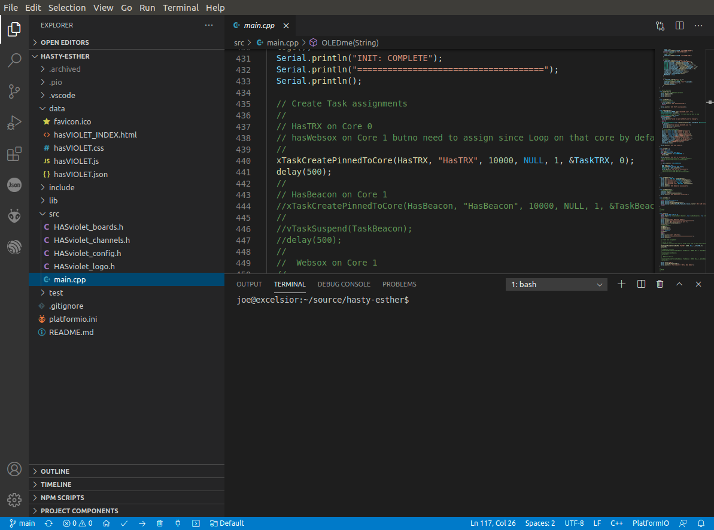
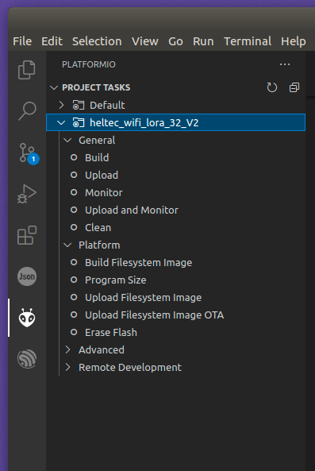
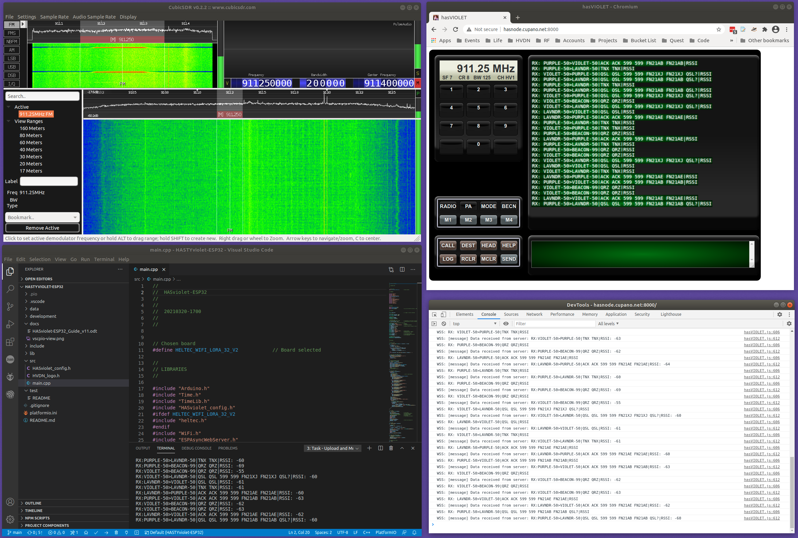

# SIGnora

SIGnora is the raw development branch for HASviolet ESP32. It is a work-in-progress LoRa transceiver platform for various use cases

Best efforts are made to document as much of the build and code as possible in unvarnished language.

## Table of Contents

- [Build It](#Build-It)

- [Watch It](#Watch-It)

- [Hack It](#Hack-It)


# Build It

All coding was performed using [Visual Studio Code](https://code.visualstudio.com/) with the [PlatformIO for VS Code extension](https://marketplace.visualstudio.com/items?itemName=platformio.platformio-ide). Follow the installation instructions for those components. Linux is my platform of choice for development. 

## Create your Workspace

I keep a home directory for all my source code so I suggest creating your own before cloning the SIGnora repo.

```
mkdir ~/source
git clone https://https://github.com/joecupano/SIGnora.git
```

Once cloned, go ahead and start Visual Studio Code and open the folder of where the cloned repo is in. You should get a screen similar to below.



If you are flashing a <a href="https://www.amazon.com/gp/product/B07WHRS2XG/" target="_blank">HiLetgo ESP32 LoRa v2 board</a> then you will not have to edit anything in `platformio.ini` but make sure <mark>`upload_port`</mark> is set to the correct device (such as<mark> /dev/ttyUSB0</mark>) which may vary depending on your operating system and other devices you have connected.

## Build and Upload firmware

Click on the alien looking icon at left, that it the PIO extention. Under Project Tasks click on the heltec board and you will see a list of commands.



With our Heltec board conenct to the USB port, click on the following commands in order after the completed with SUCCEED.

- Build Fileystem Image
- Upload Filesystem Image
- Build
- Upload

The first two commands build and uploades the file system image (aka SPIFFs) with the next commands building the application and then upload the firmware.

Just FYI, the BIN files generated are stored in `.pio/build/heltec_wifi_lora_32_v2` relative to your repo directory.

## Other Boards

All ESP32 development was done with the Heltec WiFi LoRa 32 V2 platform. Besides it being a solid platform in it's own right, we wanted avoid complicating development with platform version issues we have seen with other boards. As developing for those baords becomess better defined by the community we will include instructions and binaries for those platforms.

# Watch It

From the same PIO Proejct Tasks menu, click on 'Monitor' under the Heltect board to change the USB connection to a monitor port so you can see the log and debug messages generated by the micrcontroller.  

After that, press the RST button on the ESP32 and you should see the following boot sequeunce;

```
INIT: ESP32
=====================================
 000: Setup running on core 1
 100: SPIFFs initialized
 200: JSON loaded
 300: WiFi CL initialized
 400: Webserver initialized
 500: Websockets initialized
 600: OLED Initialized
INIT: COMPLETE
=====================================

CPU(0): Task (re)start - HasTRX (LoRa)
CPU(1): Task (re)start - WiFi, Web, WebSox
  LOOP: Started
```

# Hack It

## Architecture Model

SIGnora is made up of three parts;  radio (LoRa transceiver), server, and client.

- Server
  
  - an ESP32 device that runs Web/Websockets services for communications with the client on Core 1 and LoRa communications on Core 0
  - LoRa libraries/functions interact with the radio via the [SPI interface](http://iot-bits.com/esp32/esp32-spi-tutorial-part-1/)

- Radio
  
  - an RF hardware module (such as the [sx1276](https://www.semtech.com/products/wireless-rf/lora-transceivers/sx1276)) capable of LoRa that is either embedded or external to the ESP32 device and connected via SPI

- Client
  
  - Web browser that runs the SIGnora Web UI interface
  - Browser connects to Web service on ESP32 device and loads an [HTML file](https://https://github.com/joecupao/SIGnora/blob/main/data/INDEX.html) loaded with HTML5, CSS, and Javascript
  - On load, Javascript runs and connects to the Websocket service on the ESP32 device to establish a websocket session
  - Received data, data to be transmitted, and radio commandsare commuicated over the websocket session

## Workflow Model

### Server

This is the sequence of initialization (<mark>INIT</mark>) events that occurs doing server (ESP32) device startup from within the <mark>void setup()</mark> loop;

- **000** When the server (ESP32) device starts it initialize board specific routines and intiializes the serial port

- **100** SPIFF system initializes

- **200** Loading of the <mark>SIGnora.json</mark> file from the SPIFFs image. The server is updated with the JSON configuration

- **300** WiFi service starts first looking for an existing known network and if none then starst its own AP. The WiFi service will first try to connect to any <mark>WIFI_SSID</mark> and <mark>WIFI_KEY</mark> that was specified in <mark>config.h</mark> at compile time. If it cannot connect to an existgin WiFi specified, it will create a WiFI Access Point with the <mark>WIFI_APSSID</mark> and <mark>WIFI_APKEY</mark> specified in <mark>config.h</mark> at compile time. 

- **400** Webserver service is started with callbacks for each of the HTML, CSS. JS, JSON files. A favorico.ico is included in the SPIFFs image for browsers that (annoyingly) look for such image objects

- **500** Websocket service is started with callback for processing websocket messages

- **600** If OLED display is included, it is initialzied and will display the HVDN logo as compiled from <mark>HVDN_logo.h</mark>

- INIT is complete and LoRa services are started as a task on a separate core

#### *FreeRTOS Magic*

For many LoRa projects out there, the use case has the ESP32 as either a receiver or a transmitter but rarely both. If the use case does do both you will see alot deep dive into C/C++ in the coding yet still run into an issue with the hardware largely due to QA of the board manaufacturers. This is all because you never want LoRa receive process to miss a packet unless it is transmitting. But we also need WebSockets always running not missing a message. This led us down the path of experimenting pinning process to cores which involved touchin into the world of [FreeRTOS](https://www.freertos.org/) on the ESP32.

The ESP32 has two cores with Core 1 being the default for all operations. What we did was within <mark>void setup()</mark>  is create a LoRa services task called <mark>HasTRX</mark> and pin it to Core 0. <mark>HasTRX</mark> runs nested loops with a LoRa receive function<mark> conditional inner-loop</mark> and an endless outer-loop. Meanwhile WebSockets is running in an endless-loop within <mark>void main()</mark> on Core 1.

When <mark>HasTRX</mark> sees a LoRa packet, it captures the message and invokes a callback that sends a WebSocket client broadcast. When a TX request comes from the (browser) client via WebSockets, the <mark>sendLORA</mark> function is calledt and once the message is transmit we trip the HasTRX <mark>conditional inner-loop</mark> to restart. We use this trick for if we want to change channels from the client which includes frequency, spreadfactor, coding, and bandwidth.

Admittedly this is less than perfect but reflects our evolving education and persistence for a more perfect union of a true LoRa transciver with WebSockets.

### Radio

Our focus has been on ESP32 boards with embedded LoRa modules either from [HopeRF]([LoRa module - HOPE MicroElectronics](https://www.hoperf.com/modules/lora/index.html)) or [Semtech](https://www.semtech.com/lora/lora-products) connected via SPI. 

### Client

When the web browser connects to the server, it loads four files in the following order;

- **index.html** Besides the skeleteon look of UI, it tells the browser to load  up the CSS and JS files in that order

- **index.css** Makes the UI look pretty and add texture to actions on screen

- **index.js** Javascript code that does all the "heavy lifting." It communicates all actions as WebSocket messages to the server that include changing channels, radio settings, as well as messages to be transmitted and those received Code also includes UI usabailityt such as defining macros and UI housekeeping. The code is well documented and includes numerous logs viewable from the browsers inspect window in the consoles tab.

- **config.json** a client configuration (JSON) file loaded into from the server that includes radio, contact, macor, and channel settings. These settings are stoed in variabels and can be changed through various commands includ CMDline in the transmit window.

- **favicon.ico** A small graphic icon file to shut up browsers that look always look for icons when connecting to a server. 

During development it is common for me to run VSC with a monitor window set to view serial output, a web browser connected to the ESP32 with an inspect window open looking at the console tab, and a RTL-SDR running looking at LoRa packets fly by. All necessary since changing functionality may be an asychronous process of JS, EPS32, and HTML code updates.



# Final Thoughts

This release took longer than anticipated primarily because all coding (front to back) was done by one developer. But the time spent was a wonderful journey that will be shared on HVDN social outlets (web, videos, interview, etc) including some choices made to get the initial release out like why no SSL or user auth? Stay tuned.


