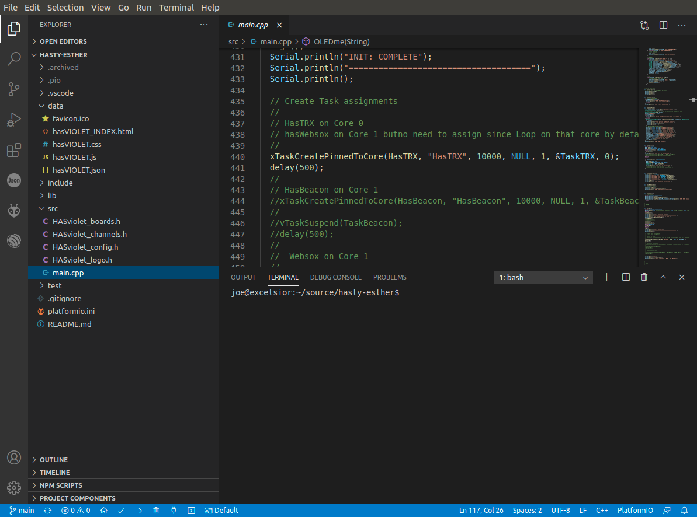
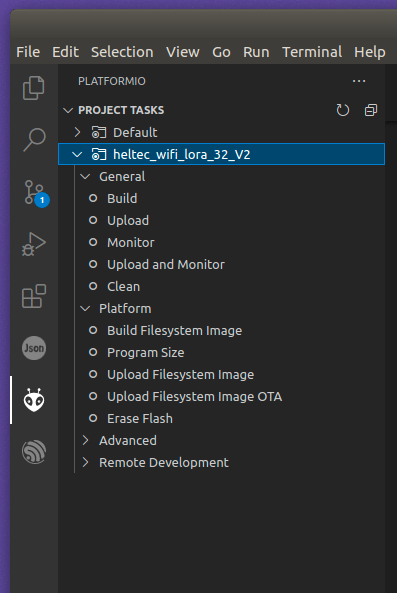
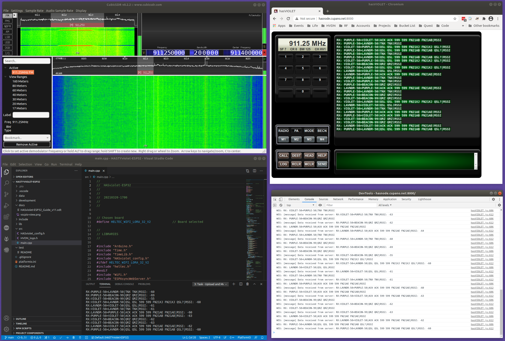

# HASviolet ESP32

HASviolet ESP32 is a (very much) work-in-progress LoRa transceiver node that is part of the HASviolet project. It is built to have as much parity as possible to [HASviolet on RPi](https://github.com/hudsonvalleydigitalnetwork/hasviolet) starting with the web user interface experience. While the Web interface for the RPi version uses SSL/TLS and User authentication, at this time HASviolet ESP32 uses neither. It will be included in a future update.

The same firmware source now builds for **13 different ESP32 boards** — see [Supported Boards](#Supported-Boards) below.

Best efforts are made to document as much of the build and code as possible in unvarnished language.

## Table of Contents

- [Supported Boards](#Supported-Boards)

- [Build It](#Build-It)

- [Watch It](#Watch-It)

- [Hack It](#Hack-It)

- [License](#License)


# Supported Boards

Board choice is picked entirely by which PlatformIO environment you build — `src/main.cpp` is the same file for every board listed below, no editing required. Pick your board's environment name from the Project Tasks tree in VS Code (or `pio run -e <name>` on the CLI).

### Heltec (SX1276, via the Heltec library)

| Environment | Board |
|---|---|
| `heltec_wifi_lora_32_v1` | Heltec WiFi LoRa 32 V1 |
| `heltec_wifi_lora_32_V2` | Heltec WiFi LoRa 32 V2 *(default)* |
| `heltec_wifi_lora_32_v3` | Heltec WiFi LoRa 32 V3 |
| `heltec_wireless_stick` | Heltec Wireless Stick |
| `heltec_wireless_stick_lite` | Heltec Wireless Stick Lite |

### LILYGO/TTGO (SX1276)

| Environment | Board |
|---|---|
| `ttgo_lora32_v1` | LILYGO/TTGO LoRa32 V1 |
| `ttgo_lora32_v2` | LILYGO/TTGO LoRa32 V2 |
| `ttgo_lora32_v21` | LILYGO/TTGO LoRa32 V2.1 |
| `ttgo_tbeam` | LILYGO/TTGO T-Beam v1.1 |

### SX1262, via RadioLib

| Environment | Board |
|---|---|
| `lilygo_t3_s3` | LILYGO T3-S3 |
| `bq_station_g2` | B&Q Station G2 |
| `tbeam_supreme` | LILYGO T-Beam Supreme (T-Beam S3-Core) |
| `heltec_wireless_tracker` | Heltec Wireless Tracker |

The `-D<BOARD>` build flags for each environment live in [platformio.ini](platformio.ini). If your board isn't on this list, it's most likely because we don't yet have real pin/config data to trust for it — see [project_state.md](project_state.md) for what's been ruled out and why, and what's next.


# Build It

All coding was performed using [Visual Studio Code](https://code.visualstudio.com/) with the [PlatformIO for VS Code extension](https://marketplace.visualstudio.com/items?itemName=platformio.platformio-ide). Follow the installation instructions for those components. Linux is my platform of choice for development. 

## Create your Workspace

I keep a home directory for all my source code so I suggest creating your own before cloning the HASviolet ESP32 repo.

```
mkdir ~/source
git clone https://github.com/hudsonvalleydigitalnetwork/hasviolet-esp32.git
```

Once cloned, go ahead and start Visual Studio Code and open the folder of where the cloned repo is in. You should get a screen similar to below.



Once you've picked your board from the [Supported Boards](#Supported-Boards) list above, the only thing you'll likely need to edit in `platformio.ini` is <mark>`upload_port`</mark> (and `monitor_port`), which needs to match your device (such as <mark>/dev/ttyUSB0</mark>) and may vary depending on your operating system and other devices you have connected. This also applies if you're flashing a <a href="https://www.amazon.com/gp/product/B07WHRS2XG/" target="_blank">HiLetgo ESP32 LoRa v2 board</a>, which is hardware-compatible with the Heltec/TTGO LoRa32 boards listed above.

## Build and Upload firmware

Click on the alien looking icon at left, that it the PIO extention. Under Project Tasks you'll see one entry per board from the [Supported Boards](#Supported-Boards) list above — expand the one matching your hardware and you'll see a list of commands.



With your board connected to the USB port, click on the following commands in order after each completes with SUCCEED.

- Build Filesystem Image
- Upload Filesystem Image
- Build
- Upload

The first two commands build and upload the file system image (aka SPIFFs) with the next commands building the application and then upload the firmware.

Just FYI, the BIN files generated are stored in `.pio/build/<environment name>` (e.g. `.pio/build/heltec_wifi_lora_32_V2`) relative to your repo directory.

# Watch It

From the same PIO Project Tasks menu, click on 'Monitor' under your board's entry to change the USB connection to a monitor port so you can see the log and debug messages generated by the microcontroller.  

After that, press the RST button on the ESP32 and you should see the following boot sequence;

```
INIT: HASviolet ESP32
=====================================
 000: Setup running on core 1
 100: SPIFFs initialized
 200: JSON loaded
 300: WiFi CL initialized
 400: Webserver initialized
 500: Websockets initialized
 600: OLED Initialized
INIT: COMPLETE
=====================================

CPU(0): Task (re)start - HasTRX (LoRa)
CPU(1): Task (re)start - WiFi, Web, WebSox
  LOOP: Started
```

# Hack It

## Architecture Model

HASviolet ESP32 is made up of three parts;  radio (LoRa transceiver), server, and client.

- Server
  
  - an ESP32 device that runs Web/Websockets services for communications with the client on Core 1 and LoRa communications on Core 0
  - LoRa libraries/functions interact with the radio via the [SPI interface](http://iot-bits.com/esp32/esp32-spi-tutorial-part-1/)

- Radio
  
  - an RF hardware module (such as the [sx1276](https://www.semtech.com/products/wireless-rf/lora-transceivers/sx1276)) capable of LoRa that is either embedded or external to the ESP32 device and connected via SPI

- Client
  
  - Web browser that runs the HASviolet ESP32 Web UI interface
  - Browser connects to Web service on ESP32 device and loads an [HTML file](https://github.com/hudsonvalleydigitalnetwork/hasviolet-esp32/blob/main/data/hasVIOLET_INDEX.html) loaded with HTML5, CSS, and Javascript
  - On load, Javascript runs and connects to the Websocket service on the ESP32 device to establish a websocket session
  - Received data, data to be transmitted, and radio commands are communicated over the websocket session

## Workflow Model

### Server

This is the sequence of initialization (<mark>INIT</mark>) events that occurs during server (ESP32) device startup from within the <mark>void setup()</mark> loop;

- **000** When the server (ESP32) device starts it initializes board specific routines and initializes the serial port

- **100** SPIFF system initializes

- **200** Loading of the <mark>hasVIOLET.json</mark> file from the SPIFFs image. The server is updated with the JSON configuration

- **300** WiFi service starts first looking for an existing known network and if none then starts its own AP. The WiFi service will first try to connect to any <mark>WIFI_SSID</mark> and <mark>WIFI_KEY</mark> that was specified in <mark>HASviolet_config.h</mark> at compile time. If it cannot connect to an existing WiFi specified, it will create a WiFi Access Point with the <mark>WIFI_APSSID</mark> and <mark>WIFI_APKEY</mark> specified in <mark>HASviolet_config.h</mark> at compile time. 

- **400** Webserver service is started with callbacks for each of the HTML, CSS. JS, JSON files. A favicon.ico is included in the SPIFFs image for browsers that (annoyingly) look for such image objects

- **500** Websocket service is started with callback for processing websocket messages

- **600** If OLED display is included, it is initialized and will display the HVDN logo as compiled from <mark>HASviolet_logo.h</mark>

- INIT is complete and LoRa services are started as a task on a separate core

#### *FreeRTOS Magic*

For many LoRa projects out there, the use case has the ESP32 as either a receiver or a transmitter but rarely both. If the use case does do both you will see a deep dive into C/C++ in the coding yet still run into an issue with the hardware largely due to QA of the board manufacturers. This is all because you never want the LoRa receive process to miss a packet unless it is transmitting. But we also need WebSockets always running not missing a message. This led us down the path of experimenting with pinning processes to cores which involved touching into the world of [FreeRTOS](https://www.freertos.org/) on the ESP32.

The ESP32 has two cores with Core 1 being the default for all operations. What we did was within <mark>void setup()</mark> is create a LoRa services task called <mark>HasTRX</mark> and pin it to Core 0. <mark>HasTRX</mark> runs nested loops with a LoRa receive function<mark> conditional inner-loop</mark> and an endless outer-loop. Meanwhile WebSockets is running in an endless-loop within <mark>void main()</mark> on Core 1.

When <mark>HasTRX</mark> sees a LoRa packet, it captures the message and invokes a callback that sends a WebSocket client broadcast. When a TX request comes from the (browser) client via WebSockets, the <mark>sendLORA</mark> function is called and once the message is transmitted we trip the HasTRX <mark>conditional inner-loop</mark> to restart. We use this trick for when we want to change channels from the client which includes frequency, spreadfactor, coding, and bandwidth.

Admittedly this is less than perfect but reflects our evolving education and persistence for a more perfect union of a true LoRa transceiver with WebSockets.

### Radio

Our focus has been on ESP32 boards with embedded LoRa modules either from [HopeRF]([LoRa module - HOPE MicroElectronics](https://www.hoperf.com/modules/lora/index.html)) or [Semtech](https://www.semtech.com/lora/lora-products) connected via SPI.

Two radio chip families are supported side by side, picked automatically by board environment: the older SX1276/SX1277 (via the Heltec library on Heltec boards, or `sandeepmistry/LoRa` elsewhere) and the newer SX1262/SX1268 (via [RadioLib](https://github.com/jgromes/RadioLib) on the boards listed under "SX1262, via RadioLib" above). Both are wrapped behind the same internal `hvLoRa` handle in `src/main.cpp`, so `HasTRX`/`sendLORA`/`onReceiveLORA` don't need to know or care which chip is actually on the board.

### Client

When the web browser connects to the server, it loads four files in the following order;

- **hasVIOLET_INDEX.html** Besides the skeleton look of the UI, it tells the browser to load up the CSS and JS files in that order

- **hasVIOLET.css** Makes the UI look pretty and adds texture to actions on screen

- **hasVIOLET.js** Javascript code that does all the "heavy lifting." It communicates all actions as WebSocket messages to the server that include changing channels, radio settings, as well as messages to be transmitted and those received. Code also includes UI usability such as defining macros and UI housekeeping. The code is well documented and includes numerous logs viewable from the browser's inspect window in the console tab.

- **hasVIOLET.json** a client configuration (JSON) file loaded from the server that includes radio, contact, macro, and channel settings. These settings are stored in variables and can be changed through various commands including CMDline in the transmit window.

- **favicon.ico** A small graphic icon file to shut up browsers that always look for icons when connecting to a server. 

During development it is common for me to run VSC with a monitor window set to view serial output, a web browser connected to the ESP32 with an inspect window open looking at the console tab, and a RTL-SDR running looking at LoRa packets fly by. All necessary since changing functionality may be an asynchronous process of JS, ESP32, and HTML code updates.



# Final Thoughts

This release took longer than anticipated primarily because all coding (front to back) was done by one developer. But the time spent was a wonderful journey that will be shared on HVDN social outlets (web, videos, interview, etc) including some choices made to get the initial release out like why no SSL or user auth? Stay tuned.

# License

HASviolet-ESP32's own code is MIT-licensed. See [LICENSE.md](LICENSE.md) for the full
text, plus attribution for every third-party library this project builds against.
